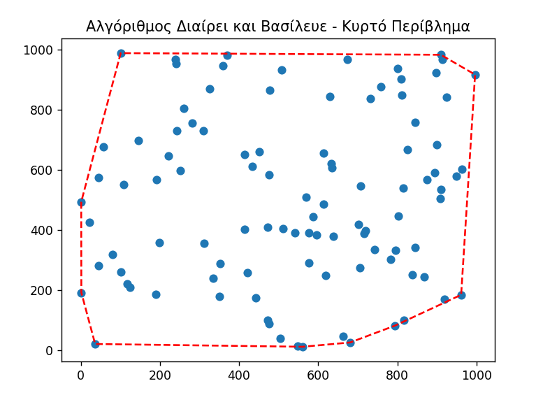
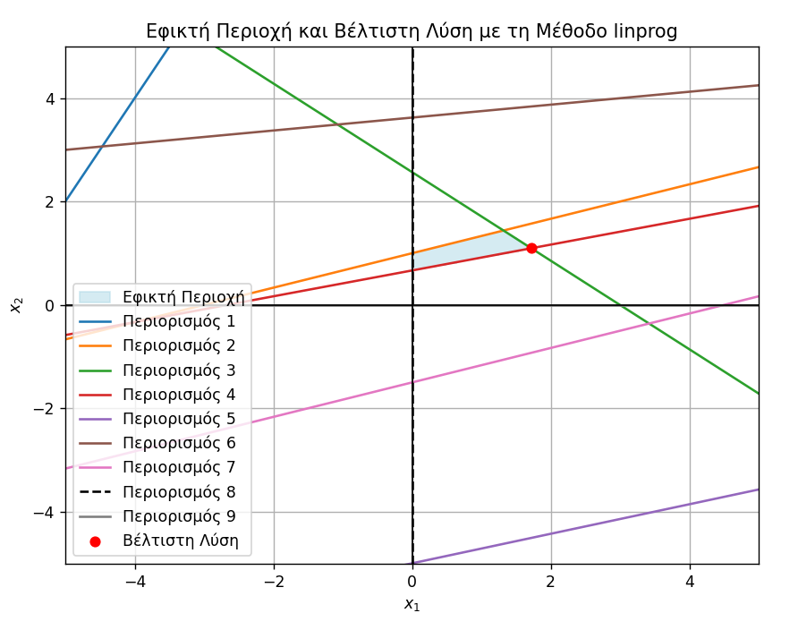

Ξεκινάμε με την αρχική τεκμηρίωση της εργασίας, βασισμένη στη μορφή που προτιμάς:

---

# **Υπολογιστική Γεωμετρία - Εργασία Χειμερινού Εξαμήνου 2024-25**

## **Στοιχεία**

- **Ονοματεπώνυμο**: Κορνήλιος Ιωάννου
- **Email**: sdi2200238@di.uoa.gr
- **Α.Μ.**: 1115202200238

## **Πληροφορίες Εργασίας**

- **Τίτλος**: Υπολογιστική Γεωμετρία
- **Περιγραφή**: Υλοποίηση αλγορίθμων κυρτού περιβλήματος, γραμμικού προγραμματισμού, διαγράμματος Voronoi - Τριγωνοποίησης Delaunay, και γεωμετρικής αναζήτησης μέσω kd-tree.
- **Μάθημα**: Υπολογιστική Γεωμετρία
- **Υπεύθυνη Καθηγήτρια**: Παρασκευή Ρούπα
- **Ημερομηνία Υποβολής**: 3 Φεβρουαρίου 2025

---

## **Εκτέλεση**

1. **Μεταγλώττιση και εκτέλεση των αλγορίθμων κυρτού περιβλήματος**
   ```sh
   python incremental.py
   python wrap.py
   python divide.py
   python quickHull.py
   ```

2. **Εκτέλεση της σύγκρισης απόδοσης των αλγορίθμων**
   ```sh
   python benchmark.py
   ```

3. **Εκτέλεση του αλγορίθμου κυρτού περιβλήματος σε 3D**
   ```sh
   python 3d.py
   ```

4. **Εκτέλεση αλγορίθμου γραμμικού προγραμματισμού και απεικόνιση της εφικτής περιοχής**
   ```sh
   python linear_prog.py
   ```

5. **Απεικόνιση Voronoi και Delaunay**
   ```sh
   python vor_del.py
   ```

6. **Εκτέλεση αναζήτησης στο kd-tree**
   ```sh
   python kd.py
   python kdv.py
   ```

---

### **Documentation Εργασίας και Ανάλυση Αποτελεσμάτων**

## **1. Εισαγωγή**

Η παρούσα εργασία αφορά την υλοποίηση και ανάλυση αλγορίθμων της Υπολογιστικής Γεωμετρίας, οι οποίοι κατηγοριοποιούνται ως εξής:

- **Αλγόριθμοι Κυρτού Περιβλήματος (Convex Hull Algorithms)**:
  - Αυξητικός αλγόριθμος
  - Περιτύλιγμα δώρου (Gift Wrapping)
  - Διαίρει και Βασίλευε (Divide & Conquer)
  - QuickHull

- **Αλγόριθμος Κυρτού Περιβλήματος σε 3D**:
  - QuickHull σε τρεις διαστάσεις

- **Γραμμικός Προγραμματισμός (Linear Programming)**:
  - Απεικόνιση εφικτής περιοχής

- **Διάγραμμα Voronoi - Τριγωνοποίηση Delaunay**:
  - Υπολογισμός και απεικόνιση

- **Γεωμετρική Αναζήτηση με KD-Tree**:
  - Κατασκευή δέντρου kd
  - Αναζήτηση σημείων εντός ορθογωνίου

---

# **Ανάλυση Αλγορίθμων Κυρτού Περιβλήματος**

## **1. Αυξητικός Αλγόριθμος**

Ο αυξητικός αλγόριθμος υπολογισμού του κυρτού περιβλήματος ακολουθεί την προσέγγιση της ταξινόμησης των σημείων και της σταδιακής προσθήκης τους στο περίβλημα, εξασφαλίζοντας ότι διατηρείται η κυρτότητα.

### **Αποτελέσματα**
Η εκτέλεση του αλγορίθμου σε ένα σύνολο 100 τυχαίων σημείων παρήγαγε το ακόλουθο αποτέλεσμα:


Το κυρτό περίβλημα, όπως φαίνεται, περικλείει τα εξωτερικά σημεία του συνόλου με γραμμή σε κόκκινο διακεκομμένο μοτίβο.


## **2. Αλγόριθμος Περιτυλίγματος Δώρου**

Ο αλγόριθμος περιτυλίγματος δώρου βασίζεται στην επιλογή του αριστερότερου σημείου και τη διαδοχική εύρεση του επόμενου σημείου που σχηματίζει τη μικρότερη αριστερόστροφη γωνία.

### **Αποτελέσματα**
Η εφαρμογή του αλγορίθμου στο ίδιο σύνολο σημείων έδωσε το παρακάτω γράφημα:


Το περίβλημα που σχηματίζεται είναι ίδιο με αυτό του αυξητικού αλγορίθμου, γεγονός που επιβεβαιώνει την ορθότητα της προσέγγισης.


## **3. Αλγόριθμος Διαίρει και Βασίλευε**

Ο αλγόριθμος "Διαίρει και Βασίλευε" διαχωρίζει τα σημεία σε δύο υποσύνολα, υπολογίζει το κυρτό περίβλημα ξεχωριστά για καθένα από αυτά και στη συνέχεια συγχωνεύει τα δύο μέρη.

### **Αποτελέσματα**

Η εκτέλεση του αλγορίθμου παρήγαγε το ακόλουθο γράφημα:



Το αποτέλεσμα είναι παρόμοιο με τους προηγούμενους αλγορίθμους, αλλά η ταχύτητα εκτέλεσης είναι συνήθως βελτιωμένη.


## **4. Αλγόριθμος QuickHull**

Ο αλγόριθμος QuickHull είναι μια παραλλαγή του QuickSort και λειτουργεί βρίσκοντας τα ακραία σημεία και επεκτείνοντας το κυρτό περίβλημα με αναδρομική διάσπαση.

### **Αποτελέσματα**

Η εκτέλεση του αλγορίθμου έδωσε το εξής αποτέλεσμα:


Η οπτική αναπαράσταση είναι ίδια με τις προηγούμενες μεθόδους, ωστόσο, ο QuickHull συχνά αποδίδει ταχύτερα σε αραιά σύνολα δεδομένων.


## **5. Σύγκριση Απόδοσης Αλγορίθμων**

Για την αξιολόγηση της αποδοτικότητας των αλγορίθμων, εκτελέσαμε μετρήσεις χρόνου για διάφορα μεγέθη σημείων και παρουσιάζουμε τη γραφική απεικόνιση:


## **6. Κυρτό Περίβλημα σε 3D**

Για την υπολογιστική γεωμετρία σε τρεις διαστάσεις, χρησιμοποιήθηκε ο αλγόριθμος QuickHull προσαρμοσμένος για 3D δεδομένα. Ο αλγόριθμος λειτουργεί επεκτείνοντας την ιδέα της αναδρομικής διάσπασης σε επίπεδα σημεία προς τρεις διαστάσεις.

### **Αποτελέσματα**

Η εκτέλεση του αλγορίθμου για 80 τυχαία σημεία στο χώρο R³ παρήγαγε το ακόλουθο αποτέλεσμα:


Το κυρτό περίβλημα εμφανίζεται ως ένα πολυεδρικό σχήμα που περικλείει όλα τα δεδομένα σημεία.


### **Παρατηρήσεις**
- Ο αλγόριθμος **Gift Wrapping** εμφανίζει τη μεγαλύτερη πολυπλοκότητα και χρόνο εκτέλεσης.
- Ο **QuickHull** και ο **Διαίρει και Βασίλευε** έχουν τη βέλτιστη απόδοση για μεγάλα σύνολα δεδομένων.
- Ο **Αυξητικός Αλγόριθμος** είναι πιο αργός από το "Διαίρει και Βασίλευε" αλλά πιο γρήγορος από το "Περιτύλιγμα Δώρου".


### **Συμπεράσματα**
Η σύγκριση των τεσσάρων αλγορίθμων καταδεικνύει ότι οι αλγόριθμοι QuickHull και Διαίρει και Βασίλευε είναι οι πιο αποδοτικοί για μεγάλες εισόδους. Αντιθέτως, το περιτύλιγμα δώρου αποδεικνύεται λιγότερο αποδοτικό λόγω της γραμμικά αυξανόμενης πολυπλοκότητας. Ο αυξητικός αλγόριθμος παρέχει μια ισορροπημένη λύση αλλά δεν ξεπερνά τους πιο αποδοτικούς αλγορίθμους.

Για εφαρμογές πραγματικού χρόνου, το QuickHull αποτελεί την πιο κατάλληλη επιλογή λόγω της γρήγορης και ευέλικτης συμπεριφοράς του.

---

# **Γραμμικός Προγραμματισμός**

## **1. Περιγραφή**
Ο γραμμικός προγραμματισμός είναι μια μαθηματική μέθοδος βελτιστοποίησης που χρησιμοποιείται για την εύρεση της βέλτιστης λύσης ενός προβλήματος υπό συγκεκριμένους περιορισμούς. Στην παρούσα εργασία, η μέθοδος Simplex εφαρμόστηκε για την εύρεση της μέγιστης τιμής μιας αντικειμενικής συνάρτησης.

## **2. Διατύπωση του Προβλήματος**
Το πρόβλημα που εξετάστηκε είναι:

$$
\max(3x_1 - 10x_2)
$$

Υπό τους περιορισμούς:

$$
\begin{aligned}
    -2x_1 + x_2 &\leq 12 \\
    x_1 - 3x_2 &\geq -3 \\
    6x_1 + 7x_2 &\leq 18 \\
    -3x_1 + 12x_2 &\geq 8 \\
    2x_1 - 7x_2 &\leq 35 \\
    -x_1 + 8x_2 &\leq 29 \\
    -2x_1 + 6x_2 &\geq -9 \\
    x_1, x_2 &\geq 0
\end{aligned}
$$

## **3. Εφαρμογή της Μεθόδου Simplex**

Χρησιμοποιώντας την μέθοδο Simplex, βρέθηκε η βέλτιστη λύση για το σύστημα περιορισμών. Η λύση αυτή αντιστοιχεί στο σημείο:

- **Βέλτιστη Λύση**: $$x_1 = 1.7204, x_2 = 1.0968$$
- **Βέλτιστη Τιμή**: $$-5.8065$$

## **4. Γραφική Αναπαράσταση**
Η παρακάτω εικόνα δείχνει την εφικτή περιοχή καθώς και τη βέλτιστη λύση που υπολογίστηκε από τον αλγόριθμο Simplex:



Στην εικόνα:
- Η σκιασμένη περιοχή αντιπροσωπεύει τον χώρο των εφικτών λύσεων.
- Οι γραμμές αναπαριστούν τους περιορισμούς του προβλήματος.
- Το κόκκινο σημείο δείχνει τη βέλτιστη λύση που προέκυψε.

## **5. Συμπεράσματα**
Η γραφική αναπαράσταση επιβεβαιώνει ότι η λύση βρίσκεται στο όριο της εφικτής περιοχής, γεγονός που είναι αναμενόμενο για προβλήματα γραμμικού προγραμματισμού. Η μέθοδος αποδείχθηκε αποδοτική στην εύρεση της μέγιστης τιμής της αντικειμενικής συνάρτησης με βάση τους περιορισμούς.

---

# **Διάγραμμα Voronoi & Τριγωνοποίηση Delaunay**

## **1. Περιγραφή**
Το διάγραμμα Voronoi και η τριγωνοποίηση Delaunay είναι δύο σημαντικές δομές στην Υπολογιστική Γεωμετρία.

- **Διάγραμμα Voronoi**: Χωρίζει το επίπεδο σε περιοχές γύρω από ένα σύνολο σημείων, όπου κάθε περιοχή αντιστοιχεί στο σημείο που βρίσκεται πλησιέστερα σε αυτήν.
- **Τριγωνοποίηση Delaunay**: Συνδέει τα σημεία με τρίγωνα ώστε να μεγιστοποιηθεί η ελάχιστη γωνία κάθε τριγώνου, αποφεύγοντας πολύ λεπτά τρίγωνα.

## **2. Υπολογισμός και Οπτικοποίηση**
Οι παρακάτω εικόνες δείχνουν την τριγωνοποίηση Delaunay και το διάγραμμα Voronoi που προέκυψαν από ένα σύνολο σημείων:

### **Τριγωνοποίηση Delaunay & Διάγραμμα Voronoi**


- Οι **πράσινες γραμμές** αναπαριστούν την τριγωνοποίηση Delaunay.
- Οι **μπλε γραμμές** δείχνουν τα όρια των κυψελών Voronoi.
- Τα **κόκκινα σημεία** είναι τα αρχικά δεδομένα σημείων.

---

### **Υπολογιστική Πολυπλοκότητα**

Η υπολογιστική πολυπλοκότητα αυτών των δομών είναι ιδιαίτερα σημαντική. Η τριγωνοποίηση Delaunay εκτελείται σε \( O(n \log n) \), ενώ το διάγραμμα Voronoi έχει παρόμοια πολυπλοκότητα.

Η παρακάτω εικόνα δείχνει τη σύγκριση του χρόνου εκτέλεσης καθώς αυξάνεται ο αριθμός των σημείων:


### **Παρατηρήσεις**
- Η **τριγωνοποίηση Delaunay** έχει καλύτερη απόδοση σε σχέση με το **διάγραμμα Voronoi**, καθώς το Voronoi απαιτεί επιπλέον υπολογισμούς για τον καθορισμό των κυψελών.
- Για πολύ μεγάλα σύνολα δεδομένων, η διαφορά στον χρόνο εκτέλεσης γίνεται πιο εμφανής.

## **3. Συμπεράσματα**
Η μελέτη αυτών των δομών δείχνει ότι η τριγωνοποίηση Delaunay είναι πιο αποτελεσματική όσον αφορά τον χρόνο εκτέλεσης, ενώ το διάγραμμα Voronoi παρέχει σημαντικές πληροφορίες για την εγγύτητα σημείων. Ανάλογα με την εφαρμογή, κάθε μία από αυτές τις μεθόδους έχει τις δικές της χρήσιμες ιδιότητες.


