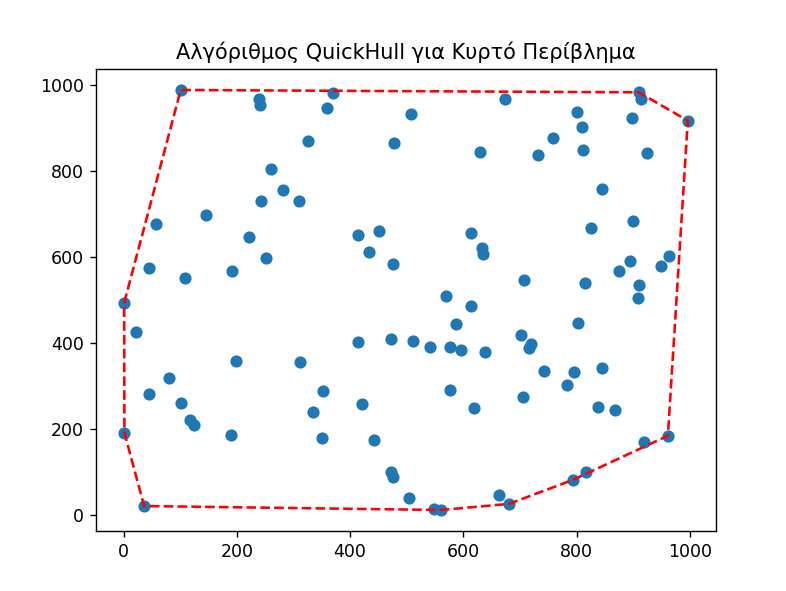

Ξεκινάω με την αρχική τεκμηρίωση της εργασίας, βασισμένη στη μορφή που προτιμάς:

---

# **Υπολογιστική Γεωμετρία - Εργασία Χειμερινού Εξαμήνου 2024-25**

## **Στοιχεία**

- **Ονοματεπώνυμο**: Κορνήλιος Ιωάννου
- **Email**: sdi2200238@di.uoa.gr
- **Α.Μ.**: 1115202200238

## **Πληροφορίες Εργασίας**

- **Τίτλος**: Υπολογιστική Γεωμετρία
- **Περιγραφή**: Υλοποίηση αλγορίθμων κυρτού περιβλήματος, γραμμικού προγραμματισμού, διαγράμματος Voronoi - Τριγωνοποίησης Delaunay, και γεωμετρικής αναζήτησης μέσω kd-tree.
- **Μάθημα**: Υπολογιστική Γεωμετρία
- **Υπεύθυνη Καθηγήτρια**: Παρασκευή Ρούπα
- **Ημερομηνία Υποβολής**: 14 Φεβρουαρίου 2025

---

## **Εκτέλεση**

1. **Μεταγλώττιση και εκτέλεση των αλγορίθμων κυρτού περιβλήματος**
   ```sh
   python incremental.py
   python wrap.py
   python divide.py
   python quickHull.py
   ```

2. **Εκτέλεση της σύγκρισης απόδοσης των αλγορίθμων**
   ```sh
   python benchmark.py
   ```

3. **Εκτέλεση του αλγορίθμου κυρτού περιβλήματος σε 3D**
   ```sh
   python 3d.py
   ```

4. **Εκτέλεση αλγορίθμου γραμμικού προγραμματισμού και απεικόνιση της εφικτής περιοχής**
   ```sh
   python linear_prog.py
   ```

5. **Απεικόνιση Voronoi και Delaunay**
   ```sh
   python vor_del.py
   python vdBenchmark.py
   ```

6. **Εκτέλεση κατασκευής kd-tree**
  ```sh
  python kdVisual.py
  ```

7. **Εκτέλεση αναζήτησης στο kd-tree**
   ```sh
   python kdSearch.py
   ```

---

### **Documentation Εργασίας και Ανάλυση Αποτελεσμάτων**

## **1. Εισαγωγή**

Η παρούσα εργασία αφορά την υλοποίηση και ανάλυση αλγορίθμων της Υπολογιστικής Γεωμετρίας, οι οποίοι κατηγοριοποιούνται ως εξής:

- **Αλγόριθμοι Κυρτού Περιβλήματος (Convex Hull Algorithms)**:
  - Αυξητικός αλγόριθμος
  - Περιτύλιγμα δώρου (Gift Wrapping)
  - Διαίρει και Βασίλευε (Divide & Conquer)
  - QuickHull

- **Αλγόριθμος Κυρτού Περιβλήματος σε 3D**:
  - QuickHull σε τρεις διαστάσεις

- **Γραμμικός Προγραμματισμός (Linear Programming)**:
  - Απεικόνιση εφικτής περιοχής

- **Διάγραμμα Voronoi - Τριγωνοποίηση Delaunay**:
  - Υπολογισμός και απεικόνιση

- **Γεωμετρική Αναζήτηση με KD-Tree**:
  - Κατασκευή δέντρου kd
  - Αναζήτηση σημείων εντός ορθογωνίου

---

# **Ανάλυση Αλγορίθμων Κυρτού Περιβλήματος**

Για όλους τους αλγορίθμους κυρτού περιβλήματος χρησιμοποιήθηκε το ίδιο σύνολο 100 τυχαίων σημείων, ώστε να διασφαλιστεί η συνέπεια και η συγκρισιμότητα των αποτελεσμάτων.

## **1. Αυξητικός Αλγόριθμος**

Ο αυξητικός αλγόριθμος υπολογισμού του κυρτού περιβλήματος ακολουθεί την προσέγγιση της ταξινόμησης των σημείων και της σταδιακής προσθήκης τους στο περίβλημα, εξασφαλίζοντας ότι διατηρείται η κυρτότητα/γωνία (δεν δημιουργούνται εσωτερικά σημεία).

### **Αποτελέσματα**
Η εκτέλεση του αλγορίθμου σε ένα σύνολο 100 τυχαίων σημείων παρήγαγε το ακόλουθο αποτέλεσμα:


## **2. Αλγόριθμος Περιτυλίγματος Δώρου**

Ο αλγόριθμος περιτυλίγματος βασίζεται στην επιλογή του αριστερότερου σημείου και τη διαδοχική εύρεση του επόμενου σημείου που σχηματίζει τη μικρότερη αριστερόστροφη γωνία.

### **Αποτελέσματα**
Η εφαρμογή του αλγορίθμου στο ίδιο σύνολο σημείων έδωσε το παρακάτω γράφημα:


Το περίβλημα που σχηματίζεται είναι ίδιο με αυτό του αυξητικού αλγορίθμου, γεγονός που επιβεβαιώνει την ορθότητα της προσέγγισης.


## **3. Αλγόριθμος Διαίρει και Βασίλευε**

Ο αλγόριθμος "Διαίρει και Βασίλευε" διαχωρίζει τα σημεία σε δύο υποσύνολα, υπολογίζει το κυρτό περίβλημα ξεχωριστά για καθένα από αυτά και στη συνέχεια συγχωνεύει τα δύο μέρη.

### **Αποτελέσματα**

Η εκτέλεση του αλγορίθμου παρήγαγε το ακόλουθο γράφημα:


Το αποτέλεσμα είναι παρόμοιο με τους προηγούμενους αλγορίθμους.


## **4. Αλγόριθμος QuickHull**

Ο αλγόριθμος QuickHull είναι μια παραλλαγή του QuickSort και λειτουργεί βρίσκοντας τα ακραία σημεία του συνόλου δεδομένων. Στη συνέχεια, διαιρεί το σύνολο σε υποσύνολα με την ευθεία που συνδέει τα δυο σημεία και επαναλαμβάνει τη διαδικασία για κάθε υποσύνολο, μέχρι να υπολογιστεί το κυρτό περίβλημα.

### **Αποτελέσματα**

Η εκτέλεση του αλγορίθμου έδωσε το εξής αποτέλεσμα:



Η οπτική αναπαράσταση είναι ίδια με τις προηγούμενες μεθόδους, ωστόσο, ο QuickHull συχνά αποδίδει ταχύτερα σε μεγάλα και αραιά σύνολα δεδομένων.


## **5. Σύγκριση Απόδοσης Αλγορίθμων**

Για να αξιολογήσω την αποδοτικότητα των αλγορίθμων, εκτέλεσα μετρήσεις χρόνου για διάφορα μεγέθη σημείων και παρουσιάζω τη γραφική απεικόνιση:


## **6. Κυρτό Περίβλημα σε 3D**

Για την υπολογιστική γεωμετρία σε τρεις διαστάσεις, χρησιμοποιήθηκε ο αλγόριθμος QuickHull προσαρμοσμένος για 3D δεδομένα. Ο αλγόριθμος λειτουργεί επεκτείνοντας την ιδέα της αναδρομικής διάσπασης σε επίπεδα σημεία προς τρεις διαστάσεις.

### **Αποτελέσματα**

Η εκτέλεση του αλγορίθμου για $80$ τυχαία σημεία στο χώρο $\mathbb{R}^3$ παρήγαγε το ακόλουθο αποτέλεσμα:


Το κυρτό περίβλημα εμφανίζεται ως ένα πολυεδρικό σχήμα που περικλείει όλα τα δεδομένα σημεία.


### **Παρατηρήσεις**
- Όλοι οι αλγόριθμοι παράγουν το ίδιο κυρτό περίβλημα για το συγκεκριμένο σύνολο σημείων.
- Ο αλγόριθμος **Gift Wrapping** εμφανίζει τη μεγαλύτερη πολυπλοκότητα και χρόνο εκτέλεσης.
- Ο **QuickHull** και ο **Διαίρει και Βασίλευε** έχουν τη βέλτιστη απόδοση για μεγάλα σύνολα δεδομένων.
- Ο **Αυξητικός Αλγόριθμος** είναι πιο αργός από το "Διαίρει και Βασίλευε" αλλά πιο γρήγορος από το "Περιτύλιγμα Δώρου".


### **Συμπεράσματα**
Η σύγκριση των τεσσάρων αλγορίθμων δείχνει ότι ο αλγόριθμος QuickHull είναι ο πιο αποδοτικός για μεγάλες εισόδους, με πολυπλοκότητα $O(n \log n)$. Αντίθετα, ο αλγόριθμος περιτυλίγματος δώρου είναι ο λιγότερο αποδοτικός λόγω της πολυπλοκότητας $O(n^2)$. Ο αυξητικός αλγόριθμος και ο αλγόριθμος "Διαίρει και Βασίλευε" βρίσκονται κάπου ενδιάμεσα, με τον αυξητικό να είναι πιο αργός από τον "Διαίρει και Βασίλευε".

Για εφαρμογές πραγματικού χρόνου, ο QuickHull αποτελεί την πιο κατάλληλη επιλογή λόγω της γρήγορης και ευέλικτης συμπεριφοράς του.

---

# **Γραμμικός Προγραμματισμός**

## **1. Περιγραφή**
Ο γραμμικός προγραμματισμός είναι μια τεχνική βελτιστοποίησης που χρησιμοποιείται για την εύρεση της καλύτερης δυνατής λύσης ενός προβλήματος, λαμβάνοντας υπόψη συγκεκριμένους περιορισμούς. Στην παρούσα εργασία, εφαρμόστηκε η μέθοδος Simplex για την επίλυση ενός προβλήματος μεγιστοποίησης της αντικειμενικής συνάρτησης, επιτρέποντας την εύρεση της βέλτιστης λύσης εντός του καθορισμένου συνόλου περιορισμών.

## **2. Διατύπωση του Προβλήματος**
Το πρόβλημα που εξετάστηκε είναι:

$$
\max(3x_1 - 10x_2)
$$

Υπό τους περιορισμούς:

$$
\begin{aligned}
    -2x_1 + x_2 &\leq 12 \\
    x_1 - 3x_2 &\geq -3 \\
    6x_1 + 7x_2 &\leq 18 \\
    -3x_1 + 12x_2 &\geq 8 \\
    2x_1 - 7x_2 &\leq 35 \\
    -x_1 + 8x_2 &\leq 29 \\
    -2x_1 + 6x_2 &\geq -9 \\
    x_1, x_2 &\geq 0
\end{aligned}
$$

## **3. Εφαρμογή**

Χρησιμοποιώντας την μέθοδο linprog, βρέθηκε η βέλτιστη λύση για το σύστημα περιορισμών. Η λύση αυτή αντιστοιχεί στο σημείο:

- **Βέλτιστη Λύση**: $$x_1 = 1.7204, x_2 = 1.0968$$
- **Βέλτιστη Τιμή**: $$-5.8065$$

## **4. Γραφική Αναπαράσταση**
Η παρακάτω εικόνα δείχνει την εφικτή περιοχή καθώς και τη βέλτιστη λύση που υπολογίστηκε:


Στην εικόνα:
- Η σκιασμένη περιοχή αντιπροσωπεύει τον χώρο των εφικτών λύσεων.
- Οι γραμμές αναπαριστούν τους περιορισμούς του προβλήματος.
- Το κόκκινο σημείο δείχνει τη βέλτιστη λύση που προέκυψε.

## **5. Συμπεράσματα**
Η γραφική αναπαράσταση επιβεβαιώνει ότι η λύση βρίσκεται στο όριο της εφικτής περιοχής, γεγονός που είναι αναμενόμενο για προβλήματα γραμμικού προγραμματισμού. Η μέθοδος αποδείχθηκε αποδοτική στην εύρεση της μέγιστης τιμής της αντικειμενικής συνάρτησης με βάση τους περιορισμούς.

---

# **Διάγραμμα Voronoi & Τριγωνοποίηση Delaunay**

## **1. Περιγραφή**

- **Διάγραμμα Voronoi**: Το διάγραμμα Voronoi χωρίζει το επίπεδο σε περιοχές που αντιστοιχούν σε ένα σύνολο σημείων. Κάθε περιοχή περιλαμβάνει όλα τα σημεία του επιπέδου που είναι πλησιέστερα σε ένα συγκεκριμένο σημείο από το σύνολο. Αυτό δημιουργεί κυψέλες γύρω από κάθε σημείο, όπου κάθε σημείο της κυψέλης είναι πιο κοντά στο κεντρικό σημείο της κυψέλης από οποιοδήποτε άλλο σημείο του συνόλου.

- **Τριγωνοποίηση Delaunay**: Η τριγωνοποίηση Delaunay είναι μια μέθοδος σύνδεσης ενός συνόλου σημείων με τρίγωνα, έτσι ώστε να μεγιστοποιείται η ελάχιστη γωνία κάθε τριγώνου. Αυτό αποφεύγει τη δημιουργία πολύ λεπτών και μακρόστενων τριγώνων, εξασφαλίζοντας μια πιο ομοιόμορφη κατανομή των τριγώνων. Η τριγωνοποίηση Delaunay είναι χρήσιμη σε πολλές εφαρμογές, όπως η γραφική αναπαράσταση και η γεωμετρική μοντελοποίηση.

- **Αντιστοίχηση διαγράμματος Voronoi και τριγωνοποίησης Delaunay**: Το διάγραμμα Voronoi και η τριγωνοποίηση Delaunay είναι αμοιβαία δυαδικά. Αυτό σημαίνει ότι αν έχουμε την τριγωνοποίηση Delaunay ενός συνόλου σημείων, μπορούμε να κατασκευάσουμε το διάγραμμα Voronoi και αντίστροφα. Οι κορυφές του διαγράμματος Voronoi είναι τα κέντρα των περιγεγραμμένων κύκλων των τριγώνων της τριγωνοποίησης Delaunay.

## **2. Υπολογισμός και Οπτικοποίηση**
Οι παρακάτω εικόνες δείχνουν την τριγωνοποίηση Delaunay και το διάγραμμα Voronoi που προέκυψαν από ένα σύνολο σημείων:

### **Τριγωνοποίηση Delaunay & Διάγραμμα Voronoi**


- Οι **πράσινες γραμμές** αναπαριστούν την τριγωνοποίηση Delaunay.
- Οι **μπλε γραμμές** δείχνουν τα όρια των κυψελών Voronoi.
- Τα **κόκκινα σημεία** είναι τα αρχικά δεδομένα σημείων.


### **Υπολογιστική Πολυπλοκότητα**

Η υπολογιστική πολυπλοκότητα αυτών των δομών είναι ιδιαίτερα σημαντική. Η τριγωνοποίηση Delaunay εκτελείται σε $O(n \log n)$, ενώ το διάγραμμα Voronoi έχει παρόμοια πολυπλοκότητα $O(n \log n)$. Αυτές οι πολυπλοκότητες καθιστούν τις μεθόδους αποδοτικές για μεγάλα σύνολα δεδομένων.

Η παρακάτω εικόνα δείχνει τη σύγκριση του χρόνου εκτέλεσης καθώς αυξάνεται ο αριθμός των σημείων:


### **Παρατηρήσεις**
- Η **τριγωνοποίηση Delaunay** είναι πιο αποδοτική από το **διάγραμμα Voronoi**, καθώς το τελευταίο απαιτεί επιπλέον υπολογισμούς για τον καθορισμό των κυψελών. Ωστόσο, η χρονική πολυπλοκότητα και των δύο μεθόδων είναι παρόμοια.
- Για πολύ μεγάλα σύνολα δεδομένων, η διαφορά στον χρόνο εκτέλεσης γίνεται πιο εμφανής.

## **3. Συμπεράσματα**
Η μελέτη αυτών των δομών δείχνει ότι η τριγωνοποίηση Delaunay και το διάγραμμα Voronoi είναι αμοιβαία συμπληρωματικές μέθοδοι. Η τριγωνοποίηση Delaunay είναι αποδοτική όσον αφορά τον χρόνο εκτέλεσης και την κατασκευή, ενώ το διάγραμμα Voronoi παρέχει πολύτιμες πληροφορίες για την εγγύτητα και τη χωρική κατανομή των σημείων. Η επιλογή της κατάλληλης μεθόδου εξαρτάται από τις συγκεκριμένες απαιτήσεις της εφαρμογής.

---

# **KD-Tree: Κατασκευή και Γεωμετρική Αναζήτηση**

## **1. Εισαγωγή**
Το KD-Tree είναι μια δομή δεδομένων που χρησιμοποιείται για την αποδοτική αναζήτηση και εύρεση σημείων εντός μιας περιοχής.

## **2. Κατασκευή του KD-Tree**
Η κατασκευή του KD-Tree ακολουθεί μια αναδρομική διαδικασία διαίρεσης του χώρου. Σε κάθε επίπεδο του δέντρου, ο χώρος χωρίζεται σε 2 ημιεπίπεδα.

### **Βήματα Κατασκευής**
Η παρακάτω εικόνα απεικονίζει τα βήματα κατασκευής του KD-Tree:


- Οι **κόκκινες διακεκομμένες γραμμές** αναπαριστούν τους κάθετους διαχωρισμούς.
- Οι **μπλε διακεκομμένες γραμμές** αναπαριστούν τους οριζόντιους διαχωρισμούς.
- Τα **μαύρα σημεία** είναι τα δεδομένα που έχουν εισαχθεί στο KD-Tree.


## **3. Γεωμετρική Αναζήτηση με KD-Tree**
Το KD-Tree χρησιμοποιείται για την αποδοτική αναζήτηση σημείων μέσα σε μια συγκεκριμένη ορθογώνια περιοχή.

### **Οπτικοποίηση Αναζήτησης**
Η παρακάτω εικόνα δείχνει τα σημεία που βρίσκονται εντός της καθορισμένης περιοχής αναζήτησης:


- Τα **μπλε σημεία** αναπαριστούν όλα τα σημεία του συνόλου δεδομένων.
- Τα **κόκκινα σημεία** είναι τα σημεία που βρίσκονται εντός του ορθογωνίου αναζήτησης.
- Το **κόκκινο διακεκομμένο πλαίσιο** δείχνει την περιοχή αναζήτησης.

### **Σημεία εντός του ορθογωνίου (2 δεκαδικά ψηφία)**
Τα σημεία που βρέθηκαν εντός της περιοχής αναζήτησης είναι:

```
(52.37, 48.24), (35.94, 31.42), (31.24, 32.95), 
(32.14, 45.74), (46.66, 49.35), (39.38, 48.19), 
(43.67, 53.98), (31.59, 56.72), (30.61, 69.4), 
(46.31, 69.99), (44.45, 64.69), (39.77, 69.73), 
(67.6, 35.06), (61.26, 30.04), (64.11, 35.9),
(64.95, 48.98), (61.47, 49.46), (52.64, 65.45)
```

## **4. Συμπεράσματα**
Το KD-Tree αποδεικνύεται μια αποτελεσματική δομή δεδομένων για την εύρεση σημείων εντός μιας ορισμένης περιοχής. Η απόδοση του εξαρτάται από την ισορροπία του δέντρου και το πλήθος των σημείων.


